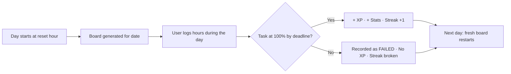
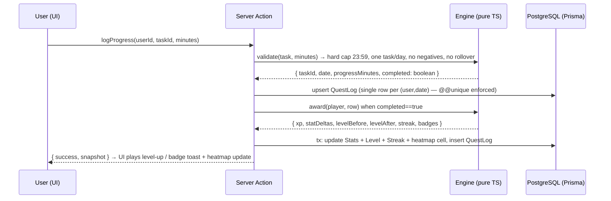

# 🥷 Daily Quests — Gamified RPG Task-Tracker Module

> **Module slug:** `daily-quests`
> **Route:** `/daily-quests`
> **Project:** My Ninjaa Way (Next.js 16 · TypeScript · Tailwind v4 · Prisma 7 · PostgreSQL · NextAuth v5 · PWA-ready)
> **Status:** Design & Implementation Specification
> **Audience:** Developers implementing this module in the existing app

A **separate module** that turns a user's daily routine into a role-playing game: every day the Dojo issues **exactly ONE Task of the Day** — a Workout *or* a Study/Reading task, measured in **hours**. The user must **complete that single task within that calendar day**. If it is not finished before the daily deadline it is **not considered completed**, and a fresh task **restarts the next day**. Completing it grants **XP and RPG stats** — the user literally levels up a character governed by:

> **Level** · **Agility** · **Strength** · **Stamina (Vitality)** · **Intelligence** · **Sense**

---

## 1. Concept Overview

The module is a "Ninja Dojo Training Log." Each day the Dojo issues **exactly one** non-negotiable task — the **Task of the Day**:

- **⚔️ Workout Task** — train for a target number of hours (the week rotates Strength / Cardio & Speed / Mobility / Endurance disciplines across workout days).
- **📖 Study/Reading Task** — for **students**: study session hours; for **adults**: book-reading hours.
- **🧩 One task per day — never both.** The weekday rotation alternates between Workout days and Study/Reading days, so both pillars are trained over the week.
- **🌱 Start easy, grow slowly.** Every pillar begins beginner-friendly (45 min workout / 1h study / 30m reading) and rises only in tiny fixed steps as days are *completed* — **CONSISTENCY is the engine of difficulty, never a slider** (§4.6).

Because streaks, habits, and identity matter more than any single day, the daily task is **all-or-nothing**: partial progress is tracked live, but the reward is only minted when the task reaches **100% before the daily reset**. Miss it — the day is recorded as a *failed task* (no XP), a fresh task restarts at the next reset.



---

## 2. Core Rules (The "Within A Day" Contract)

| Rule | Behavior |
|---|---|
| **Hard deadline** | The single task must reach 100% by the configured daily reset time (default `23:59:59` local; configurable, e.g. `05:00` for early-birds). |
| **One task per day** | Exactly **one** task (Workout *or* Study/Reading) exists per day, enforced by a DB `@@unique([userId, date])`. A second task cannot be started once today's is completed. |
| **No carry-over** | Logged hours never roll into the next day. A task logged at 99% then hit by reset is **failed**, not "almost done." |
| **Auto-restart** | At each reset a new task is created for the new `date` with fresh `progress = 0`. The task type is deterministic by weekday so the week has a rhythm. |
| **Consistency ladder** | The target starts beginner-easy and climbs in small fixed steps — and **only after a completed day** of that pillar. Missing days pause the climb; a long absence eases it back toward base so returns are always inviting (§4.6). |
| **Not-completed ≠ cancelled** | Failed tasks stay visible in History (and dimmed in the heatmap) with a `failed` status so users can learn from the pattern. |
| **Streak honesty** | A day counts toward a streak **only if the single daily task** finishes. |
| **Stat awards** | Stats are awarded **only on 100% completion**. Partial progress gives no stat point (but keeps the motivation bar honest). |

**Day-window definition (single source of truth):**

```ts
// dayKey(date) → "YYYY-MM-DD" derived from the user's local timezone
function dayKey(d: Date): string {
  const y = d.getFullYear();
  const m = String(d.getMonth() + 1).padStart(2, "0");
  const day = String(d.getDate()).padStart(2, "0");
  return `${y}-${m}-${day}`;
}
```

All progress rows are stored under `dayKey_DATE`; the reset simply generates the next key. The legacy lesson of the existing `Meal` model (`date String // YYYY-MM-DD` + `@@index([userId, date])`) is reused deliberately here.

## 3. RPG Stat System

### 3.1 Level & XP

- User earns **XP** exclusively from **completed** daily tasks (one per day).
- **Level** is a pure function of total lifetime XP — no separate "level points" to spend.
- XP-to-level curve (balanced for ~1 task/day):

```
xpForLevel(level) = 100 × level^1.4        // XP needed to go FROM `level` TO `level+1`
```

| Level | XP needed for next level | ≈ Days of full completion |
|---|---|---|
| 1 | 100 | 2 |
| 2 | 264 | 4 |
| 3 | 471 | 7 |
| 5 | 952 | 14 |
| 8 | 1 922 | 27 |
| 12 | 3 615 | 51 |
| 20 | 7 620 | 109 |

### 3.2 The Six Gauge Areas

| Stat | Icon | Primary source | Description | Visual color |
|---|---|---|---|---|
| **Level** | 🎖️ | Total XP | Overall progression; unlocks titles, themes, badges | Gold `#f59e0b` |
| **Strength** | 💪 | Strength workouts (weights, calisthenics, combat training) | Physical raw power | Red `#ef4444` |
| **Agility** | ⚡ | Cardio, sprints, mobility, yoga flows | Speed, reflexes, flexibility | Cyan `#06b6d4` |
| **Stamina (Vitality)** | ❤️ | Endurance/steady-state workouts, hydration, sleep, daily streaks | Resilience, health, willpower | Green `#22c55e` |
| **Intelligence** | 🧠 | Study / book-reading hours (the Study/Reading task) | Knowledge, memory, problem solving | Violet `#8b5cf6` |
| **Sense** | 👁️ | Mobility days, daily reflection notes, streak awareness | Perception, focus, mindfulness | Amber `#f97316` |

### 3.3 Stat points & growth

- Every completed daily task awards **stat points** to its governing gauges (see the reward table in §4.3 for exact weights).
- Stat bars are capped at **100 points per tier**; crossing 100 raises the *tier* and keeps growing:

| Tier | Points |
|---|---|
| Novice 🗡️ | 0 – 99 |
| Adept 🛡️ | 100 – 199 |
| Expert 🔥 | 200 – 349 |
| Master 👑 | 350 – 499 |
| Legend 🐲 | 500+ |

- On each **Level Up**, the user can **read an RPG-style title** ("🧠 Novice Scholar → Adept Scholar") and unlocks one cosmetic **badge slot** — pure gamified reinforcement, no pay-to-win.

### 3.4 What each stat "does" (productized)

- **Intelligence** is a *goal* stat — it never resizes targets. Difficulty is owned by the **Consistency Ladder** (§4.6): targets grow only from completed days, in small fixed steps, hard-capped. The game is: *start easy, grow slowly, keep showing up.*
- **Stamina** gates streak forgiveness once per week (a "Focused/Tired" day where targets are halved) — a mercy mechanic that protects motivation.
- **Sense** grows through Mobility workout days and the optional reflection note attached to any completed task (no second task — see 💯 Perfect Day in §4.3).
- **Strength & Agility** determine which workout disciplines appear on heavier days of the weekly rotation.

> Balance principle: **stats should grow, but the game should never punish health.** All adaptive pacing is capped and never allowed to zero out the day's task.

## 4. Daily Quests — One Task Per Day

The board for a given day = **exactly ONE Task of the Day** — either a **⚔️ Workout Task** or a **📖 Study/Reading Task**, never both, never zero. The week alternates so both pillars are trained (see the week rhythm below), and the task carries a **target in hours** — set by the Consistency Ladder (§4.6), beginner-easy and growing only with completed days — plus **live progress vs target** and a **countdown to reset**.

### 4.1 The Workout Task — Mon · Wed · Fri · Sat (governs Strength · Agility · Stamina)

On Workout days the discipline rotates so training is periodized instead of monotonous:

| Day | Discipline | Primary stats | Example |
|---|---|---|---|
| Mon | Strength | 💪 Strength · ❤️ Stamina | Weights / calisthenics / combat drills |
| Wed | Cardio & Speed | ⚡ Agility · ❤️ Stamina | Running, cycling, jump rope, HIIT |
| Fri | Mobility & Core | ⚡ Agility · 👁️ Sense | Yoga, stretching, balance work, core |
| Sat | Endurance (heavy) | ❤️ Stamina · 💪 Strength | Long steady-state run/ride/walk + light strength |

> Tue · Thu · Sun are **Study/Reading days** (§4.2) — the discipline table above fills only the 4 workout days.

**Target (hours):** set by the **workout ladder** (§4.6): **45 min on Day‑1**, **+2 min per completed workout day**, hard cap **120 min (2h)**. Never user-set, never fixed.
**Weekly total:** ≈ 3h on week 1, gently rising to ≈ 7h at full consistency — a steady ramp, because the ladder only climbs as days are completed.
**Saturday heavy day:** the Endurance session runs at **1.25×** the ladder target (cap 150 min, `heavyDayMultiplier`, §4.6), keeping one heavier day per week without breaking the ramp.

### 4.2 The Study/Reading Task — Tue · Thu · Sun (governs Intelligence) — Student vs Adult

The module adapts to the user's **life role** (set in onboarding, editable anytime):

| Mode | Task name | Target (hours) | Notes |
|---|---|---|---|
| **Student** 🎓 | 📚 Study Task | **Ladder: base 1h → cap 3h** (+2 min per completed Study day; school hours are *not* double counted; dedicated self-study: homework, revision, courses, practice) | Syncs with exam-week flag |
| **Adult** 💼 | 📖 Reading Task | **Ladder: base 30m → cap 1h30m** (+1 min per completed Reading day) of book reading (physical, Kindle, audio) | Any non-fiction/self-development/fiction counts; no social media |

Both are hour-based and comply with the **within-a-day rule**. The module intentionally lets the adult pick *books* because the requirement is "reading books is necessary" — the adult profile **cannot** substitute passive videos for reading. The two pillars never run on the same day: **Mon/Wed/Fri/Sat = Workout**, **Tue/Thu/Sun = Study/Reading** (or the user's manual choice, §4.5).

### 4.3 Reward table (one task = one reward)

| Task of the Day | XP | 💪 Str | ⚡ Agi | ❤️ Sta | 🧠 Int | 👁️ Sense |
|---|---|---|---|---|---|---|
| ⚔️ Workout (Strength day) | 120 | **+3** | +1 | +2 | — | — |
| ⚔️ Workout (Cardio/Speed day) | 120 | +1 | **+3** | +2 | — | — |
| ⚔️ Workout (Endurance day) | 120 | +1 | +1 | **+3** | — | +1 |
| ⚔️ Workout (Mobility day) | 90 | +1 | +2 | +1 | — | +2 |
| 📖 Study Task (student) | 110 | — | — | — | **+4** | +1 |
| 📖 Reading Task (adult) | 110 | — | — | — | **+3** | +1 |

**💯 Perfect Day:** finishing the day's single task **plus a one-line reflection note** attached to the completion awards **+40 bonus XP** and +1 👁️ — still exactly one task, no second task is ever issued.
**Daily XP:** ≈ **130–160** (task + optional Perfect Day bonus) — single-task leveling stays fair and streak-driven.

### 4.4 Sample boards (one task per day)

**🎓 Student — Tuesday (Study day)**

```
┌──────────────────────────────────────────────────────────────┐
│  DOJO · Date 12 — Tue 12 Sep · Reset in 08:43:12              │
│  ✦ TASK OF THE DAY (1/1)                                      │
│  ──────────────────────────────────────────────────────────── │
│  📚 Study (self-study)    target 2h      [▓▓▓░░░░░░░] 1h 15m │
│  🔥 Streak 9 · 💯 Perfect if finished with a reflection note  │
│        [+15m] [+30m] [+1h]                          [ +Log ] │
└──────────────────────────────────────────────────────────────┘
```

**💼 Adult — Saturday (Workout day)**

```
┌──────────────────────────────────────────────────────────────┐
│  DOJO · Date 17 — Sat 17 Sep · Reset in 12:14:56              │
│  ✦ TASK OF THE DAY (1/1)                                      │
│  ──────────────────────────────────────────────────────────── │
│  🏃 Endurance Run         target 1h30m   [▓▓▓▓▓▓░░░░] 1h 05m │
│  🔥 Streak 12 · 💯 Perfect if finished with a reflection note │
│        [+15m] [+30m] [+1h]                          [ +Log ] │
└──────────────────────────────────────────────────────────────┘
```

Tomorrow's card is already different: Tue = Study today, Wed = Workout tomorrow. **One task in, one task out.** Both samples show users **midtower** — the 2h study / 1h30m workout targets are ladder *outcomes* (§4.6), not defaults. A brand-new user's Day‑1 board shows the **base**: 45 min workout, 1h study, 30m reading.

### 4.5 Quest configuration (stored per user)

```ts
type QuestSettings = {
  role: "student" | "adult";        // drives Study vs Reading task
  rotation: "auto" | "manual";      // auto = weekday rhythm (§4.2); manual = user picks today's task type
  workoutCapMinutes?: number;       // ladder cap override (default 120) — base 45, +2 min per completed workout day (§4.6)
  studyCapMinutes?: number;         // ladder cap override (default 180) — base 60, +2 min per completed study day (§4.6)
  readingCapMinutes?: number;       // ladder cap override (default 90) — base 30, +1 min per completed reading day (§4.6)
  heavyDayMultiplier: number;       // default 1.25 — Saturday Endurance = × ladder workout target (§4.6)
  resetHour: number;                // 0–23, default 23 (23:59 deadline) or 5 for early birds
};
```

- **One task per day** is enforced at two levels: the UI shows a single card and the DB enforces `@@unique([userId, date])` (§6).
- **Manual rotation** lets a user swap the day's type *before starting it* (e.g., "study day, but I want the gym today") — once the task has progress > 0% or is completed it locks.
- **The Consistency Ladder owns all difficulty** (§4.6) — the numbers above are *caps/pace*, never day-to-day targets. There is **no "set your hours" slider** to shrink a task (and self-sabotage): caps are floors-guarded (min cap = that pillar's base), so a ladder can never start lower than Day‑1.
- Everything is stored on `UserQuestProfile`; one click on the dashboard toggles **student ↔ adult** (regenerates the next day's task, keeps all stats).

### 4.6 The Consistency Ladder — "start easy, grow slowly" (progressive difficulty)

Difficulty is **never a slider and never random** — it is the honest pay-off of **CONSISTENCY**. Every pillar has its own ladder: a **beginner base**, a **small fixed step per completed day**, and a **hard cap**. Only *completed* days add a step, so the ladder and the heatmap (§8.7) are the same signal seen from two sides: the record paints the cells, the ladder sets the next target.

| Pillar | Base (Day‑1) | Step per completed day | Cap | Sessions to cap |
|---|---|---|---|---|
| ⚔️ Workout | 45 min | +2 min | 120 min (2h) | ~38 (≈ 9–10 weeks) |
| 📚 Study (student) | 1h | +2 min | 3h | ~60 (≈ 5 months) |
| 📖 Reading (adult) | 30 min | +1 min | 1h 30m | ~60 (≈ 5 months) |

```ts
// lib/daily-quests/engine.ts — pure, single source of truth
const LADDERS = {
  workout: { base: 45, step: 2, cap: 120 },   // minutes
  study:   { base: 60, step: 2, cap: 180 },
  reading: { base: 30, step: 1, cap: 90 },
} as const;

function computeLadderTarget(pillar: Pillar, completedOfPillar: number, capOverride?: number): number {
  const { base, step, cap } = LADDERS[pillar];
  return Math.min(capOverride ?? cap, base + completedOfPillar * step);
}
// completedOfPillar = COUNT(QuestLog WHERE questType = pillar AND status = "completed")
```

**Why it is *slow* on purpose:**

- **Day‑1 is the easiest day there will ever be** — 45 min workout / 1h study / 30m reading. A beginner is never handed a wall.
- **Gentle, day-by-day ramp** — each completed day adds only 2 (or 1) minutes. Example (student, week 1, all 4 workout days done): Mon **45** → Wed **47** → Fri **49** → Sat endurance **56** (1.25 × 45). Visible progress every single session — but never a spike.
- **Consistency is the only fuel** — a missed day adds **no step**; the next identical pillar keeps today's target (plateau, not punishment). After **7+ consecutive missed days** the target eases back **1 step per missed week**, floored at the base — a long break lowers the door, it never slams it. A forborne "Focused Rest" day (§5.2) protects the *streak* but still adds **no step**: the ramp only counts genuine completions.
- **Capped forever** — 2h / 3h / 1h 30m is *maintenance mode*: once reached, volume holds there indefinitely (a full year at full consistency is still a human schedule). Nobody is ever assigned a 4-hour workout.
- **Stamped per day** — the value is frozen into that day's `QuestLog.targetMinutes` at issue time, so past boards and the formula itself can evolve independently (§9).
- **Pace ≠ pay** — XP and stats come from the fixed §4.3 table, never from session length: a 45-min beginner day and a cap-length day pay the same. The ladder gates **pace**, not **pay**.
- **User caps only raise comfort** — optional cap overrides (§4.5) must be ≥ base; you can only choose how high you'd never go, never shrink the floor.

## 5. Game Engine (server-side pure module)

All balance logic lives in a framework-agnostic engine at `lib/daily-quests/engine.ts` so it is unit-testable:



### 5.1 Awarding rules (pure functions)

```ts
// .../engine.ts (signatures)
computeLadderTarget(pillar: Pillar, completedOfPillar: number, capOverride?: number): number // base + step×completed, clamped to cap (§4.6)
applyEaseBack(targetMinutes: number, consecutiveMissedDays: number): number                  // −1 step per 7 missed days, floored at base (§4.6)
computeTodayTask(date: Date, settings: QuestSettings, history: HistorySummary): QuestTemplate // 1 task via weekday rhythm, target from ladder
validateLog(task: QuestTemplate, minutes: number): boolean            // 0 < minutes ≤ 1440·60, same dayKey
awardTask(completed: boolean, isPerfectDay: boolean): { xp: number; stats: Partial<Stats> } // §4.3 table
applyStreak(lastStreak: number, lastCompleteKey: string, todayKey: string): number
applyXP(xpBefore: number, gain: number): { level, xpInLevel, nextLevelAt, leveledUp }
// HistorySummary = { completedByPillar: Record<Pillar, number>, // ladder steps banked so far (§4.6)
//                    missesStreakDays: number }                 // current consecutive-miss count for ease-back
```

### 5.2 Streaks & combo

| Mechanic | Rule |
|---|---|
| **Daily Streak 🔥** | +1 per day the single daily task is completed; resets to 0 at first miss. |
| **Perfect Day 💯** | Finishing the single daily task **with a reflection note** awards **+40 bonus XP** and a "Perfect Day" badge chip — no second task, just a better ending. |
| **Streak titles** | No XP multiplier (keeps math honest); streaks unlock cosmetic titles: 7-day "Sparring Partner", 30-day "Dojo Regular", 100-day "Sensei Material" — all visible as gold runs on the consistency heatmap. |
| **Forgiveness** | At Stamina Tier ≥ Expert, one miss per week can be absorbed by streak via the "Focused Rest" day (§3.4). |

### 5.3 Achievements / badges

Persisted per user (`Achievement` join table). Examples:

- 🥇 **First Blood** — first completed task.
- 🧗 **Climber** — any pillar reaches **half** its ladder cap (e.g., workout ladder ≥ 60 min).
- 🏁 **Summit** — any pillar reaches its ladder cap (full maintenance mode).
- 🔥 **On A Roll** — 7-day streak.
- 💪 **Iron Fist** — 50 Strength points.
- 🧠 **Bookworm** — 30 Reading/Study tasks completed.
- 👁️ **Zen Eyes** — 30 Sense points.
- ☀️ **Early Riser** — 10 tasks finished before 9 AM.
- 🐲 **Legend** — reach Level 10.

## 6. Data Model (Prisma)

Follows the existing repo conventions (`schema.prisma`: `String @id @default(uuid())`, `DateTime` audit columns, `userId` relations with `onDelete: Cascade`, `date String // YYYY-MM-DD` pattern from `Meal`).

```prisma
// ── Daily Quests Module ──────────────────────────────────────────

model UserQuestProfile {
  id                      String   @id @default(uuid())
  userId                  String   @unique
  user                    User     @relation(fields: [userId], references: [id], onDelete: Cascade)
  role                    String   @default("student")      // "student" | "adult"
  rotation                String   @default("auto")         // "auto" weekday rhythm | "manual" user pick (swaps once pre-start)
  workoutCapMinutes       Int?                              // ladder cap override (default 120) — §4.6
  studyCapMinutes         Int?                              // ladder cap override (default 180) — §4.6
  readingCapMinutes       Int?                              // ladder cap override (default 90) — §4.6
  heavyDayMultiplier      Float    @default(1.25)           // Saturday Endurance = × ladder workout target (§4.6)
  resetHour               Int      @default(23)             // daily deadline hour (23 = 23:59 local)
  startedAt               DateTime @default(now())          // ladder + consistency denominator (day 0)
  createdAt               DateTime @default(now())
  updatedAt               DateTime @updatedAt
  // NOTE: ladder targets are DERIVED at issue time from QuestLog completed-counts (§4.6) — never stored on the profile.
}

model QuestLog {
  id              String   @id @default(uuid())
  userId          String
  user            User     @relation(fields: [userId], references: [id], onDelete: Cascade)
  date            String   // YYYY-MM-DD (from dayKey(), single source of truth)
  questType       String   // workout | study | reading   (ONE per day — the rule)
  discipline      String?  // strength | cardio | endurance | mobility | recovery … (workout days)
  targetMinutes   Int         // frozen ladder value at issue time (§4.6)
  progressMinutes Int      @default(0)
  status          String   @default("active") // active | completed | failed | forborne
  reflectionNote  String?  // 💯 Perfect Day optional one-liner
  completedAt     DateTime?
  awardedXp       Int      @default(0)
  streakEligible  Boolean  @default(true)    // always true — the single daily task
  createdAt       DateTime @default(now())
  updatedAt       DateTime @updatedAt

  @@unique([userId, date])   // ★ one task per day — DB-enforced
  @@index([date])
}

model PlayerStats {
  id           String   @id @default(uuid())
  userId       String   @unique
  user         User     @relation(fields: [userId], references: [id], onDelete: Cascade)
  xp           Int      @default(0)
  level        Int      @default(1)
  strength     Int      @default(0)
  agility      Int      @default(0)
  stamina      Int      @default(0)
  intelligence Int      @default(0)
  sense        Int      @default(0)
  streak       Int      @default(0)
  bestStreak   Int      @default(0)
  lastCompleteKey String? // "YYYY-MM-DD" of the last fully-completed day
  perfectDays  Int      @default(0)
  createdAt    DateTime @default(now())
  updatedAt    DateTime @updatedAt
}

model Achievement {
  id        String   @id @default(uuid())
  slug      String   @unique
  title     String
  emoji     String
  hint      String
  predicate String   // JSON-ish condition expression evaluated by engine (single source of truth)
  createdAt DateTime @default(now())
}

model UserAchievement {
  id            String       @id @default(uuid())
  userId        String
  user          User         @relation(fields: [userId], references: [id], onDelete: Cascade)
  achievementId String
  achievement   Achievement  @relation(fields: [achievementId], references: [id], onDelete: Cascade)
  unlockedAt    DateTime     @default(now())

  @@unique([userId, achievementId])
}
```

**Migration note:** run `npx prisma migrate dev --name add_daily_quests_module`, then seed the `Achievement` catalogue in `prisma/seed.ts` using the same `upsert` pattern as existing module seeds.

Also register the module so it appears on the Dashboard:

```ts
// prisma/seed-modules.ts — add to the `modules` array
{
  slug: "daily-quests",
  title: "Daily Quests",
  description: "Gamified daily workout & study tracker with RPG stats — level up every day.",
  icon: "Swords",
  href: "/daily-quests",
},
```

```ts
// components/ModuleCard.tsx — add the lucide icon next to Calculator/Apple/Users
import { Calculator, Apple, Users, Swords, type LucideIcon } from "lucide-react";
// ... MODULE_ICONS = { Calculator, Apple, Users, Swords }
```

## 7. Server Actions & Route Structure

All actions live in `lib/actions/daily-quest-actions.ts` (`"use server"`, matching `client-actions.ts`), guarded by `checkUserModuleAccess("daily-quests")` + `revalidatePath` on every mutation.

```ts
// lib/actions/daily-quest-actions.ts — public API surface
export async function getDailyBoard(): Promise<DailyBoardSnapshot>    // today's ONE task + ladder + stats + streak
export async function logProgress(taskId: string, minutes: number)    // adds minutes (Σ within cap)
export async function completeTaskWithReflection(taskId: string, minutes: number, note?: string)
export async function pickTodayTask(type: "workout" | "study" | "reading") // "manual" rotation only
export async function updateQuestProfile(settings: QuestSettings)
export async function getConsistency(rangeMonths?: number): Promise<ConsistencySnapshot> // heatmap payload
export async function getHistory(monthKey?: string): Promise<DaySummary[]>
export async function getAchievements(): Promise<{ unlocked: UserAchievement[]; catalogue: Achievement[] }>
```

### 7.1 Checkpointing (lazy fail)

No cron process is required. Every read first runs:

```ts
async function dailyCheckpoint(userId: string, todayKey = dayKey(new Date())) {
  const open = await prisma.questLog.findMany({ where: { userId, status: "active" } });
  for (const log of open) {
    if (log.date < todayKey) {                       // expired — deadline passed
      await prisma.questLog.update({ where: { id: log.id }, data: { status: "failed" } });
    }
  }
  const stats = await prisma.playerStats.findUnique({ where: { userId } });
  if (stats && stats.lastCompleteKey && stats.lastCompleteKey < todayKey && stats.streak > 0) {
    await prisma.playerStats.update({ where: { userId }, data: { streak: 0 } }); // honest streak reset
  }
  await ensureTodayTask(userId, todayKey);          // create/refresh today's single task (ladder target, §4.6) if missing
}
```

This guarantees the **within-a-day contract** is enforced even if the user never opens the app at reset time — no background worker needed in v1 (a cron can be added later as a pure optimization).

### 7.2 File/folder layout (mirrors existing modules)

```
app/daily-quests/
  page.tsx                      # server component → access check → <DayBoard/>
  loading.tsx
components/daily-quests/
  DayBoard.tsx                  # client shell: 3-column dashboard (bento grid)
  TodayTaskCard.tsx             # THE hero card: single Task of the Day, progress, quick-log, countdown
  StatHexagon.tsx               # radar/hexagon chart of the 5 stats
  XpRing.tsx                    # circular level ring
  StreakFlame.tsx               # streak counter with flame animation
  LevelUpModal.tsx              # celebratory level-up overlay (confetti)
  LogMinutesModal.tsx           # quick-log hours: +/- stepper, optional reflection note
  ConsistencyHeatmap.tsx        # 12-month GitHub-style consistency heatmap (§8.7)
  HistoryView.tsx               # day list + heatmap drill-down drawer
  AchievementShelf.tsx          # badge grid, locked vs unlocked
  SettingsPanel.tsx             # student/adult toggle, rotation mode, hour targets, reset hour
  WeekRhythm.tsx                # Mon–Sun rhythm strip (which pillar each day)
lib/daily-quests/
  engine.ts                     # pure game logic (unit-testable)
  quest-templates.ts            # weekday rhythm + reward table (single source of truth)
  dates.ts                      # dayKey(), resetDeadline(), countdown formatting
lib/actions/daily-quest-actions.ts
prisma/schema.prisma            # +4 models (§6)
prisma/seed.ts                  # achievement catalogue + module upsert
```

### 7.3 Auth guard (follows `checkUserModuleAccess`)

```ts
// app/daily-quests/page.tsx
const access = await checkUserModuleAccess("daily-quests");
if (!access.authorized) redirect("/");
```

Optionally make the module **public-by-default** (like `calorie-calculator`/`nutrition`) by adding `"daily-quests"` to the early-return list in `auth-actions.ts:212` if the product wants zero-friction onboarding.

## 8. UI/UX Design (Best-in-class)

### 8.1 Design language

| Aspect | Direction |
|---|---|
| **Theme** | "Dark Dojo" — matches the app's existing `zinc-900/black` surfaces but adds a parchment-gold accent and per-stat colors. Continues Tailwind v4 + `lucide-react` + rounded-3xl cards already used across the app. |
| **Colors** | Base `zinc-950/900` cards on `bg-zinc-50/black`; gold `#f59e0b` for Level/XP; stat colors from §3.2 (red, cyan, green, violet, amber). Completed = emerald pulse (same language as `ModuleCard` "Accessible" chip). |
| **Type** | Existing Geist Sans for UI; **Geist Mono** for the countdown timer (`tabular-nums`) and logged hours — a "training log" feel. |
| **Micro-copy tone** | Motivating ninja flavor, never guilt-tripping: "Tonight the dojo closes at 23:59 — 1 task remains." |
| **Motion** | XP bar fills with `ease-out`; level-up = modal + confetti burst; stat points float up (+3 💪) on completion; countdown ticks every second; flame pulses on streak days. All motion respects `prefers-reduced-motion`. |
| **Responsive** | Mobile-first single column → tablet 2-col → desktop 3-col bento grid. Bottom-sheet modal for logging on mobile (thumb zone). |
| **PWA** | Reuses the existing manifest/service-worker. New: **Daily Reminder** at 19:00 local + **Day-End Warning** at 22:00 using the Notification API (available because the app is already installable). |

### 8.2 Dashboard wireframe (desktop day view)

```
┌────────────────────────────────────────────────────────────────────────────┐
│ 🥷 DOJO — Day 12 · Tue 12 Sep                    ⏳ Reset in 08:43:12 🔔  │
├──────────────────────┬──────────────────────────────────┬──────────────────┤
│  CHARACTER PANEL     │  ✦ TASK OF THE DAY (1/1)          │  CONSISTENCY     │
│  ┌────────────────┐  │  ┌─────────────────────────────┐  │  (last 12 months)│
│  │       🎖️        │  │  📚 Study           2h        │  │  ░▒▒▒▒▒░ ░░░▒▒░░  │
│  │   LEVEL 7        │  │  [▓▓▓▓▓▓░░░░░░░░] 1h15/2h    │  │  ▒▒▒▒▒▒☐ ░▒▒▒▒░   │
│  │  ▚▚▚▚▚▚░░ XP    │  │      [+15m] [+30m] [+1h]     │  │  ▓▓░▓▓▓▓░ ░░▒▒▒░   │
│  │  320/498         │  │  💯 Perfect: finish w/ note  │  │  ░░▒▒▒▒▒▒ ░▒▒▓░░   │
│  │  🔥 Streak 9     │  │  🎁 +110 XP · +4 🧠 · +1 👁️  │  │  ▒▒░░░░▒▒ ░░▓▓░░   │
│  │                  │  │                     [ +Log ] │  │  consistency 76%  │
│  │    ⚡  💪         │  └─────────────────────────────┘  │  [◀ 2026 ▶] [All]  │
│  │      ╲╱          │                                    ├──────────────────┤
│  │   ❤️  🧠         │                                    │  ACHIEVEMENTS     │
│  │      ╱╲          │                                    │  🥇 🔥 🧠 🐲 🗝️  │
│  │       👁️         │                                    └──────────────────┘
│  │  (stat hexagon)  │
│  ├──────────────────┤
│  │ ⚙️ Settings       │
│  │ role: 🎓 student │
└──────────────────────┴──────────────────────────────────┴──────────────────┘
```

Only **one card** on the board (the `1/1` chip makes the contract visible). The right rail is now the **Consistency Heatmap** (§8.7) — the truthful record that the whole RPG is built on. Each task's target is today's **ladder value**: the sample shows a student 30 Study-days in (`2h` = base 1h + 30 × 2 min, §4.6), and the `🌱 step 30/60` chip beside the hour readout makes the *source* of difficulty visible (a brand-new student instead sees `1h`, the easiest day ever).

### 8.3 TodayTaskCard anatomy (the hero component)

1. **Header row** — stat-icon chip, task title, discipline badge, and the **`1/1` chip** proving today has exactly one task.
2. **Live countdown chip** — mono font, red when < 1h remain (`tabular-nums`).
3. **Progress bar** — target-graded (green < 70%, amber 70–99%, gold **at 100%** → shatter/slash anim + `COMPLETED` stamp) that instantly refreshes the day's heatmap cell.
4. **Hour readout + ladder chip** — `1h 15m / 2h` with one-tap **+15m**, **+30m**, **+1h** quick chips, or a stepper modal for precision; beside it a `🌱 Ladder 30/60 · +2m next day` chip that names the difficulty's source (§4.6). The target visibly climbs only when days are completed — and never backwards on a miss.
5. **Reward row** — preview at 100%: `+110 XP · +4 🧠 · +1 👁️`; the optional one-line reflection field converts a complete task into a 💯 **Perfect Day**.
6. **Expired state** — greyed-out card, ⚰️ `FAILED — the dojo closed at 23:59`, "Tomorrow's task is already waiting" CTA → full auto-restart visible (heatmap cell + streak updated immediately).

### 8.4 Stat hexagon (visualization)

Renders the 5 player gauges (Agility, Strength, Stamina, Intelligence, Sense) as a radar polygon, each axis normalized to the current tier. Interaction: hover a vertex → tooltip with tier + "next unlock at X pts". Perfect-Day days add a subtle glow to the polygon.

### 8.5 Key interactions & accessibility

| Interaction | Behavior |
|---|---|
| Log progress | **Optimistic UI**: progress bar animates instantly, server action reconciles; failures restore with a toast. |
| Level-up | Full-screen modal: old→new level, title change, confetti, "Continue" button. Never interrupts combat (no forced waits). |
| Countdown | The task card shows time-left; the header countdown flips to red at <1h and plays a soft chime (mutable, PWA notification). |
| History | Click any heatmap cell → day drawer with the task breakdown, reflection note, and reward log (XP earned etc). |
| Accessibility | WCAG AA contrast, `aria-live="polite"` for progress/completion announcements, keyboard shortcuts (`L` log, `S` settings), focus trap in modals, `prefers-reduced-motion` honored, touch targets ≥ 44px. |
| Onboarding | First visit = 3-step wizard: (1) I am a 🎓 student / 💼 adult, (2) optional ladder caps ("the most I'd ever want", defaults = standard caps §4.6), (3) reset time → generates a **beginner Day‑1 board** (45 min workout / 1h study / 30m reading). No account friction beyond existing auth. |

### 8.6 Level-up moment (example)

```
┌──────────────────────────────┐
│   🎊  LEVEL UP!  🎊           │
│                              │
│     LEVEL 7  ➜   LEVEL 8     │
│  🧠 Adept Scholar unlocked    │
│                              │
│   +320 XP earned this week    │
│   +12 🧠 · +9 💪 · +9 ⚡      │
│   New badge: 🐲 "Dojo Regular"│
│                              │
│        [ CONTINUE ]           │
└──────────────────────────────┘
```

### 8.7 The Consistency Heatmap (you can't hide from a habit)

The module's second signature view: a **GitHub-style calendar heatmap** that shows *consistency* — the entire daily record honest and visible — across the last **12 months**. One cell = one day = the single daily task. This is the *truth layer* the whole RPG sits on top of.

**What each cell means:**

| Cell | Meaning | Color |
|---|---|---|
| `░` empty | No task exists yet (before the user joined / not yet started) | Transparent outline |
| `▒` grey | `failed` — task was issued but not completed | `zinc-700` |
| `▓` green | `completed` — the single task finished | `#16a34a` |
| `★` gold | `completed` **+ 💯 Perfect Day** (with reflection note) | `#f59e0b` |
| `☐` pulsing | **today** — live cell, pulses until reset | animated ring |

**Layout & interactions:**

```
        CONSISTENCY · last 12 months                Consistency: 87%  (Jan–Sep)
  ┌──────────────────────────────────────────────────────────────┐
  │  Mon ░░▒▒▒░░ ░▒▒▒▒▒░ ░▒▒▒ ░░▒▒ ░░░▒▒ ░▒▒░ ░░░░  ▒  ▒▒       │
  │  Tue ░░░▒▒░░ ▒▒▒▒▒▒▒ ☐  ▒▒▒ ░░░▒ ▒▒▒▒ ░▒▒░ ▒▒▒░░  ▒  ▒▒      │
  │  Wed ░▒▒▒▒░░ ▒░▒▒▒▒▒ ▒▒▒  ▒▒░ ░▒▒▒ ▒▒▒░ ░▒▒░░░ ▒▒  ▒  ▒      │
  │  ...   (one column per week, one cell per day)               │
  │  Sun ░▒▒▒▒▒░ ★▒▒▒▒▒▒ ▒▒▒  ░▒▒ ▒▒▒▒ ▒▒▒░ ▒▒▒▒▒▒ ▒▒  ▒  ▒      │
  │                 [◀  2025  ▶]    [All ▾]   Legend ░▒▓★        │
  └──────────────────────────────────────────────────────────────┘
            (click any cell → day drawer → task breakdown)
```

- **Consistency score** — headline number next to the streak: `🔥 9-day streak · 87% consistent`. Formula: `completedDays ÷ daysSinceStart`, with **Perfect Days counting double weight** so the score rewards finishing *well*, not just finishing.
- **Ladder meters** — under the filter chips, one progress rail per pillar (`⚔️ 45→120 min` · `📚 1h→3h` · `📖 30→90 min`) showing current target vs cap. A rail advances **exactly when a heatmap cell turns `▓`** — the difficulty arc and the honest record are literally the same signal (§4.6).
- **Month navigation** — `◀ ▶` paging over a 12-month window (swipable on mobile); the default view always lands on the current week.
- **Filter chips** — `All · ⚔️ Workout · 📖 Study/Reading · 💯 Perfect` to spot which pillar is slipping.
- **Drill-down** — any cell opens the day drawer (§8.5) with the task, hours, reflection note, and XP earned.
- **Live feedback** — logging progress updates today's cell in place; on reset, an uncompleted today becomes grey `▒` with no fanfare.
- **Semantic truth** — streaks, anti-farming heuristics (§9), and the *Sparring Partner / Dojo Regular* titles are all computed from this same `QuestLog` table — what the heatmap shows is exactly what the engine rewards.

## 9. Edge Cases & Anti-cheat

| Case | Handling |
|---|---|
| **Daylight Saving Time** | All deadlines computed from the user's numeric `resetHour` on their local date; spring-forward/fall-back just means that one day is 23h or 25h. `dayKey()` always uses local calendar date. |
| **Timezone travel** | Board/streak keyed to the *device's current local date*; stats are global. A note chip shows the local reset time so travel bugs become visible, not mysterious. |
| **Rounding hours** | Minutes stored as integers; UI rounds to nearest minute. 0.5h stored as 30 min — no floating-point drift. |
| **Logging after deadline** | Server rejects `progressMinutes` writes whose `date < todayKey` (`validateLog`). Administratively: no retroactive completion. |
| **One-task rule** | `@@unique([userId, date])` means **no second task** can exist for the same day; `logProgress` on an already-completed task is rejected (read-only board). |
| **99% then reset** | `dailyCheckpoint` marks `failed`; XP and stats are **not** awarded. The user sees the honest history. |
| **Missed days & the ladder** | A miss adds **no step** — the next identical pillar stays at today's target (plateau, not punishment). ≥ 7 consecutive missed days ease the target back **1 step per missed week**, floored at base — a long break lowers the door, it never slams it (§4.6). |
| **Ladder is derived, not stored** | Each target is computed at issue time from `QuestLog` completed-counts and frozen on its own row. Changing role, caps, or reset hour never rewrites past targets or grants retroactive steps — the only way *up* the ladder is a completed day (§4.6). |
| **Farming** | One task/day + caps: progress ≤ 1.5× target counts as 100% (grace), beyond that **no extra XP** (XP mirrors the §4.3 fixed table, not per-minute). |
| **Data deletion** | All rows cascade on user delete (`onDelete: Cascade`), matching every existing module. |
| **Offline (PWA)** | Log entries buffer in `IndexedDB` and flush to the server on reconnect with the same date-key validation; a stale buffer from a past day is rejected by the server and surfaced as "expired" — the within-a-day contract always wins. |

## 10. Implementation Checklist (repo-aware)

- [ ] `prisma/schema.prisma` — add `UserQuestProfile`, `QuestLog` (with `@@unique([userId, date])` one-task rule), `PlayerStats`, `Achievement`, `UserAchievement` (§6).
- [ ] `prisma/seed.ts` — upsert `Achievement` catalogue; **seed-modules.ts** — add `daily-quests` module entry (§6).
- [ ] `components/ModuleCard.tsx` — register `Swords` icon (§6).
- [ ] `lib/daily-quests/` — `dates.ts`, `quest-templates.ts`, `engine.ts` (§5) incl. `computeLadderTarget` + `applyEaseBack` (§4.6) with unit tests (plateau, ease-back, cap, stamping).
- [ ] `lib/actions/daily-quest-actions.ts` — board / log / complete-with-reflection / pickTodayTask / consistency / settings / history / achievements (§7).
- [ ] `app/daily-quests/page.tsx` + `loading.tsx` with `checkUserModuleAccess("daily-quests")` (§7.3).
- [ ] `components/daily-quests/` — `TodayTaskCard` + heatmap + all 12 components (§7.2, §8).
- [ ] Onboarding wizard (role → optional ladder caps → reset hour) (§8.5); `🌱` ladder chip on `TodayTaskCard` + ladder meters on the heatmap (§8.3, §8.7).
- [ ] ConsistencyHeatmap wiring: `getConsistency()` range query + day drill-down (§8.7).
- [ ] PWA reminders: 19:00 nudge, 22:00 day-end warning (§8.1).
- [ ] Wipe-clean test script for a day rollover (assert failed → fresh single task → streak reset → heatmap cell dims).
- [ ] `pnpm dev` / `pnpm build` green; run `eslint` clean.

## 11. Future Roadmap (out of v1 scope)

- 🌙 **Night Mode schedules** — aspirationally evaluate "tasks before 10 PM only" as a user preference.
- 👥 **Training parties** — friend streak reflect ("Maya's streak: 12 — beat challenger").
- 📊 **Stat evolution charts** — 30/90/365-day stat sparklines per gauge.
- 🎯 **Weekly Boss Quests** — e.g., "Run 10 km this week" × composite workout volume.
- ♻️ **Retention analysis** — best-reset-hour recommendations from a user's own completion history.
- 🏆 **Public profile** — optional shareable dojo card (level + top stat) for social proof.

---

**Definition of done:** a user opens `/daily-quests`, sees a **single Task of the Day** in under a second, logs 60 minutes of workout, and — if they never finish — wakes up tomorrow to a **fresh single task**, yesterday stamped `failed`, the consistency heatmap cell dimmed, streak honestly reset, and today's task waiting. The next day's target nudged up only because a day was completed — **Day‑1 is the easiest day there will ever be** (45 min workout) and difficulty grows slowly, on consistency alone (§4.6). They never feel punished, only summoned. 🥷